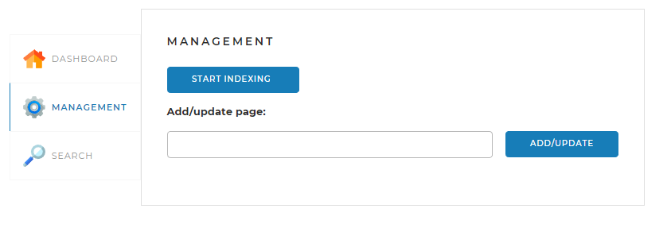

# Searchengine
Данный проект реализует поисковый движок, предоставляющий пользователю специальный
API со следующими основными функциями: 
<li>предварительное индексирование сайтов;</li>
<li>выдача основных сведений по сайтам;</li>
<li>поиск ключевых слов в проиндексированных сайтах и предоставление их пользователю.</li>

## Стэк используемых технологий
Spring Framework, JPA, JSOUP, SQL, Morphology Library Lucene

## Веб-страница

В проект также входит веб-страница, которая позволяет управлять процессами, реализованными
в движке.

Страница содержит три вкладки.

### Вкладка DASHBOARD

Эта вкладка открывается по умолчанию. На ней
отображается общая статистика по всем проиндексированным сайтам, а также
детальная статистика и статус по каждому из сайтов (статистика,
получаемая по запросу <i>/statistics</i>).

### Вкладка MANAGEMENT

На этой вкладке находятся инструменты управления 
поисковым движком — запуск (запрос <i>/startIndexing</i>) 
и остановка (запрос <i>/stopIndexing</i>) полной индексации
(переиндексации), а также возможность добавить (обновить)
отдельную страницу по ссылке (запрос <i>/indexPage/{pagePath}</i>).

### Вкладка SEARCH

Эта вкладка предназначена для тестирования поискового
движка. На ней находится поле поиска и выпадающий список с
выбором сайта, по которому искать, а при нажатии на кнопку
<i>SEARCH</i> выводятся результаты поиска (по запросу /search).

## Файл настройки
<i>application.yaml</i>

### Раздел server

В этом разделе задаётся параметр <i>port</i> — порт, через который контроллеры 
приложения "слушают" веб-запросы. Задавая разные порты, можно, например, 
из разных папок, в которых находятся файлы настройки, запустить несколько 
экземпляров приложения.

### Раздел spring

Здесь задаются параметры СУБД, в которой приложение хранит 
данные конфигурации.

### Раздел config
Список сайтов для индексации.

<b>Для прохождения аутентификации в приложении необходимо ввести логин и пароль</b>

login: admin password: admin

